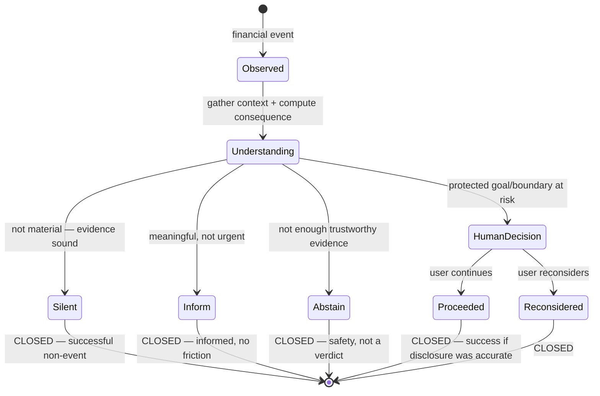
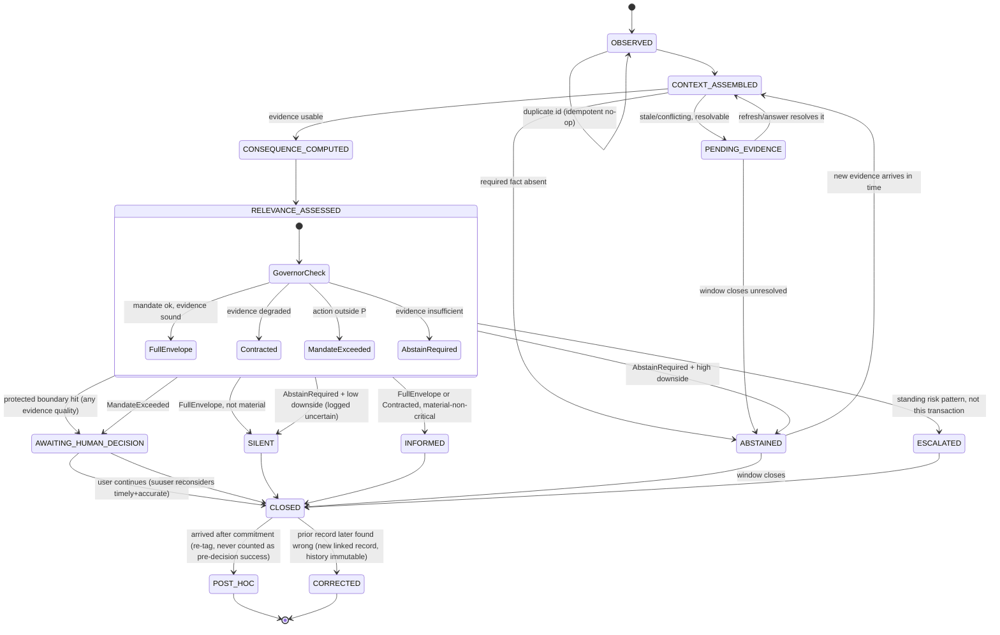

# Question 3 — Vantage's Runtime State Machine

*Working document. Preserves H1–H9 from Questions 1–2. Produced as a full audit before writing the competition answer, per instruction: attack the generic model, define what counts as a state, test a two-machine design, build happy and unhappy flows, stress-test with invariants and simulations, red-team, and only then write the final response.*

---

## Part 1 — Attacking the generic state machine

The default shape most teams would reach for:

```
USER INPUT → FETCH DATA → ANALYZE → RECOMMEND → USER APPROVES → ACTION → SUCCESS / FAILURE
```

Discarded, not improved. Six specific reasons it cannot represent Vantage:

1. **No terminal state for correct silence.** Every cycle funnels toward a recommendation. There's no way to represent H4 — deciding not to interrupt as a legitimate, loggable, successful outcome. In this shape, "nothing happened" isn't a state; it's the absence of one, which makes it unauditable later.
2. **"ANALYZE" collapses the one boundary the whole product is built to preserve.** H1 separates deterministic financial arithmetic from agentic judgment. A single ANALYZE box makes that boundary invisible — a financial-risk reviewer reading the diagram cannot tell where computation ends and reasoning begins.
3. **"RECOMMEND → USER APPROVES → ACTION" is the L2 shape**, not conservative L3 (H7). It assumes every cycle produces a proposal awaiting yes/no. Most events, under Vantage's design, should never generate a recommendation at all.
4. **No representation of evidence quality.** ANALYZE assumes data is always sufficient and current. This directly contradicts H9, whose entire premise is that missing or stale data must never silently produce a confident recommendation. A model with no epistemic state structurally cannot produce ABSTAIN.
5. **SUCCESS/FAILURE is too coarse to hold H3/H6.** A user proceeding after ASK is a success if disclosure was accurate and timely — not automatically a failure because the transaction happened. This shape has no room for that distinction, nor for ABSTAIN as a third, non-binary outcome.
6. **It's linear and single-machine.** It cannot express that the same lifecycle stage behaves differently depending on orthogonal evidence/autonomy conditions — the actual content of H9.

Discarded. The final model is built from Vantage's failure modes and accountability commitments, not from generic agent architecture.

---

## Part 2 — What counts as a state

A **state** is a condition where entering it changes at least one of:

1. what information Vantage is waiting for,
2. what Vantage is permitted to do,
3. what Vantage believes it knows,
4. what human authority is required,
5. what transition can happen next,
6. what must be recorded for later reasoning.

**Explicitly not states**, and why:

- **A tool call** (e.g. `getGoalConsequence`) — an implementation detail performed *while* Vantage occupies a state. Its result may cause a transition; the call itself isn't one.
- **A single deterministic calculation** — part of the work done inside a state unless its output changes one of the six criteria above.
- **A UI screen** — a presentation concern. Multiple screens can render the same underlying state; a screen change alone is not a state change.
- **A raw API response** — becomes relevant only once validated and incorporated. The *validated* result, not the response itself, is what can trigger a transition.
- **An action** (e.g., "show the INFORM message") — the state machine's output upon entering a state, not the state itself.

This is why "MEMORY UPDATED" from the prompt's hypothesis list is **not** modeled as its own visited state below: nothing ever waits there — it's an atomic write performed as part of the transition into `CLOSED`. It changes criterion 6 but never criteria 1–5, and nothing is ever "in" that condition long enough to need its own node.

---

## Part 3 — Two interconnected machines

Two machines, not one, and not fully independent — **Machine B gates Machine A's transition guards.**

### Machine A — Financial Decision Lifecycle
Per-event, ephemeral. One instance per observed financial event.

**States**: `OBSERVED → CONTEXT_ASSEMBLED → CONSEQUENCE_COMPUTED → RELEVANCE_ASSESSED → { SILENT | INFORMED | AWAITING_HUMAN_DECISION | ESCALATED | ABSTAINED } → CLOSED`, with `PENDING_EVIDENCE` as a recoverable hold state, `POST_HOC` as the U15 branch, and `CORRECTED` as a post-closure amendment record.

The prompt's hypothesis list is revised: "USER DECISION" and "OUTCOME OBSERVED" are merged into `AWAITING_HUMAN_DECISION`'s resolution (the human's response *is* the outcome — there's no daylight between them at this design stage, since Vantage has no execution power to observe separately from the human's own choice). "MEMORY UPDATED" is removed as a state per Part 2's reasoning.

### Machine B — Autonomy Governor
**Not an independently-transitioning, persisted state machine.** This is a deliberate answer to the prompt's open question. Machine B has two parts with different natures:

- **P (the standing mandate)** *is* real persisted state — it changes rarely, only through explicit user action (grant, revoke, expand). This is genuine memory.
- **C_t, R_t, D_t (confidence, reversibility, downside)** are **computed fresh at each checkpoint** from currently-observable facts (data freshness, source agreement, the consequence engine's own output). They have no transition history of their own — there is nothing to "recover" them from, because they aren't stored; they're recalculated.

Machine B's *output* — the thing Machine A's guards actually read — is one of four **operating envelopes**, derived by a governor function applied to P, C_t, R_t, D_t:

- `FULL_ENVELOPE` — autonomy ceiling P is fully usable.
- `CONTRACTED_ENVELOPE` — governor voluntarily restricts below P (forces INFORM instead of SILENT, or ASK instead of autonomous handling) even though P would permit more.
- `ABSTAIN_REQUIRED` — evidence too poor to safely exercise any of P; the correct move is abstention, not a stretched judgment.
- `MANDATE_EXCEEDED` — the needed action sits outside P entirely, regardless of evidence quality.

This directly implements H9's "permission is a ceiling, not an instruction to act": P alone never causes an action; the governor decides how much of P is currently earned.

**The design question the prompt asks — can the same lifecycle state behave differently depending on evidence/autonomy state — is answered yes, concretely:**

```
CONSEQUENCE_COMPUTED + governor=FULL_ENVELOPE     → RELEVANCE_ASSESSED proceeds to autonomous classification
CONSEQUENCE_COMPUTED + governor=CONTRACTED_ENVELOPE → RELEVANCE_ASSESSED's ceiling for this event drops one tier
CONSEQUENCE_COMPUTED + governor=ABSTAIN_REQUIRED   → transition to ABSTAINED instead of any classification
CONSEQUENCE_COMPUTED + governor=MANDATE_EXCEEDED   → transition to AWAITING_HUMAN_DECISION regardless of confidence
```

This two-machine model is not rejected for complexity — it is the mechanism that makes H9 real rather than aspirational language.

---

## Part 4 — Happy flow (three legitimate successful terminals)

### Happy Path A — Correct silence
- **Entry**: `OBSERVED` — new transaction ingested, deduplicated by transaction id.
- **Evidence retrieved** (`CONTEXT_ASSEMBLED`): budget position, liquidity buffer, active-goals-at-risk, intervention history — all return complete, fresh, single-source-uncontested or corroborated.
- **Deterministic calculation** (`CONSEQUENCE_COMPUTED`): `getGoalConsequence` run against every active goal; no delta crosses the material threshold; buffer-floor check passes with margin.
- **Agent reasoning** (`RELEVANCE_ASSESSED`): governor = `FULL_ENVELOPE` (all evidence sound, no protected-boundary proximity) → classification = not material.
- **Autonomy-governor check**: confirms P permits autonomous SILENT for the "routine" tier; R_t and D_t both low.
- **Transition trigger**: not-material + `FULL_ENVELOPE` → `SILENT`.
- **What's logged**: an `Intervention` record — `actionTaken: "silent"`, the trigger facts (utilization, buffer margin, delta ≈ 0), and the evidence-quality snapshot that justified it. This is an auditable non-event, not a missed one.
- **Why no user interaction**: H4 — correctly deciding not to interrupt *is* the successful outcome here; interrupting would be the failure.
- **How SILENT is later verified correct**: retrospective check — if a subsequent goal-trajectory divergence traces back to this transaction without having been flagged, this record is revisited through the `CORRECTED` protocol (Part 5, U12).

### Happy Path B — Useful information without friction
- Same entry through `CONSEQUENCE_COMPUTED`; this time delta crosses into "material but not major" (no protected-floor or committed-obligation proximity).
- `RELEVANCE_ASSESSED` classifies as material-non-critical; governor = `FULL_ENVELOPE` → autonomous INFORM permitted.
- **What makes INFORM different from SILENT**: a consequence artifact is generated and surfaced — a plain trajectory statement, H3-compliant, no judgment — but nothing blocks the transaction and no response is required.
- **What the user sees**: e.g., "This ₹18,000 moves your postgraduate fund target by about 16 days. You're otherwise within plan this month."
- **Acknowledgement required?** No — required by H4's no-friction principle. Delivery is recorded; reading is not gated.
- **How it closes**: transitions to `CLOSED` once rendered — "delivered" is tracked distinctly from "acknowledged" (see U8).
- **Memory updated**: `Intervention` with `actionTaken: "inform"`, `consequenceShown`, and no `userResponse` field (INFORM has none by design).

### Happy Path C — Human decision at the boundary
- Same through `CONSEQUENCE_COMPUTED`; this time the deterministic protected-floor/committed-obligation guardrail (H8's refined clause) fires independently of the softer classifier.
- **Why autonomy contracts**: governor = `CONTRACTED_ENVELOPE` or forced `AWAITING_HUMAN_DECISION` — a hard rule, not a confidence judgment, forces this regardless of how good the evidence otherwise is (this is U6, made concrete).
- **What's presented**: the computed consequence (date-shift, amount vs. buffer floor), framed plainly.
- **What Vantage may recommend vs. decide**: it may show the computed consequence and which stated priority looks at risk. It may **not** say whether the purchase is good or bad (H3), and it may **not** withhold the transaction itself (H8) — only a human-authorized rail action, if one exists for this specific flow, could do that, and even that sits behind this very ASK.
- **Options presented**: Continue / Reconsider.
- **After each option**: *Continue* → `CLOSED`, `userResponse: "continued"` — **recorded as success if the consequence shown was accurate and timely**, per the explicit instruction that a human choosing to proceed must be capable of being a successful outcome under H6. *Reconsider* → `CLOSED`, `userResponse: "reconsidered"`.
- **Recording without over-interpreting**: this single instance writes only to the `Intervention` record. It never writes to `InterventionPreference` (the standing-boundary table) unless the user takes a *separate*, explicit action to set one — see U10.

---

## Part 5 — Unhappy flow (seventeen distinct failure semantics)

Each failure is classified against a taxonomy tested for completeness in Part 8. Transition rules are exact, not descriptive.

**U1 — Missing data.** Required fact (e.g., current savings, category spend) is absent. Governor evaluates: is the missing fact required for *this* computation? If yes → `ABSTAIN_REQUIRED`; transition to `ABSTAINED` (visible or silent-logged — see Part 6, gated by downside). If the missing fact is not required for this specific event, proceed on the facts that are present, with the gap noted in the evidence snapshot.

**U2 — Stale data.** Distinct from missing: the fact exists but its freshness timestamp exceeds the threshold for this fact-type (transaction data has a tight freshness window; goal parameters, being user-set, have none). Governor: `CONTRACTED_ENVELOPE` at minimum — SILENT becomes unavailable for this event even if the numbers would otherwise support it; the minimum action rises to INFORM (qualified: "based on data from N days ago") or, if the stale fact is decision-critical (e.g., buffer level for a near-floor transaction), `PENDING_EVIDENCE` pending refresh.

**U3 — Conflicting data.** Two sources disagree beyond tolerance (reusing the existing `deltaPercent >= 8` reconciliation pattern already in the codebase). Vantage must not silently pick one. The conflicting field is quarantined — marked unusable for this decision. Calculations not touching that field proceed normally; calculations that require it transition to `PENDING_EVIDENCE` (if resolvable by asking a targeted question) or `ABSTAINED` (if not).

**U4 — Rail unavailable.** Distinguished as a **capability** failure, not epistemic. Financial context and consequence calculation can proceed unaffected. What becomes unavailable is *only* the promise of an execution-linked option inside `AWAITING_HUMAN_DECISION` (e.g., an offered hold/cancel). Vantage may still INFORM; it must not claim it can act through a rail that is currently down. Modeled as a capability flag checked at the `RELEVANCE_ASSESSED → AWAITING_HUMAN_DECISION` transition guard, not a new top-level state.

**U5 — Outside mandate.** Distinct from low confidence — this is an **authority** failure. Evidence can be perfect; the contemplated action simply isn't inside P. Governor = `MANDATE_EXCEEDED` regardless of C_t. Routes to `AWAITING_HUMAN_DECISION` with `reason: mandate_exceeded`.

**U6 — High confidence, high consequence.** The governor never equates confidence with permission. `FULL_ENVELOPE` evidence quality does not override a protected-boundary hit — the deterministic guardrail (H8 refinement) forces `AWAITING_HUMAN_DECISION` independent of C_t. This is Happy Path C's actual mechanism, restated as the negative case.

**U7 — Low confidence, low consequence.** The opposite failure mode: bothering the user over something trivial is itself a cost. If D_t (downside) is low, `ABSTAIN_REQUIRED` resolves to **silent-logged abstention** (see Part 6) rather than a clarification request. This is the rule that prevents H9 from creating notification overload.

**U8 — User ignores an INFORM.** Recorded neutrally: `userResponse: "no_acknowledgment"` — never "disagreement," never "ignored" framed negatively. The event closes normally. Must **not** be inferred as: disagreement, indifference to the category, or grounds to change future classification. Only an explicit, separate preference action (U10) can do that.

**U9 — User proceeds after ASK.** Not automatically a failure — this is Happy Path C's `Continue` branch, restated: success if the consequence was accurate, disclosure was timely, and the choice was the user's own. Required to preserve H3/H6.

**U10 — Repeated overrides.** Three record types kept distinct: **observed behavior** (raw fact — N consecutive "continued" responses on category X), **explicit preference** (a stored `InterventionPreference`), **inferred preference** (Vantage's own guess). Rule: observed behavior alone never silently modifies governor thresholds. After a defined pattern (e.g., 3–4 consecutive continues on the same category, no protected-boundary involvement), Vantage *may* surface a single, explicit, one-time ASK: "Would you like me to change how I handle this?" — itself an ASK-tier event, not an autonomous change. Declined or ignored → no change, and no immediate re-offer.

**U11 — Goal changes midstream.** Not a failure — a legitimate invalidation trigger. Any parameter change (target, deadline, protected floor) invalidates cached `CONSEQUENCE_COMPUTED` results for that goal on any still-**open** Machine A instance (`PENDING_EVIDENCE`, open `ABSTAINED`), forcing re-entry to `CONSEQUENCE_COMPUTED`. `CLOSED` events are **not** retroactively recomputed — history stays immutable (Invariant 11).

**U12 — Incorrect prior intervention.** A `CLOSED` record is immutable, but a correction is real. Design: a new record with `correctsInterventionId` pointing at the original, plus a disclosed explanation. Disclosure to the user is proportional: if the original SILENT/INFORM was materially wrong on something that touched a protected boundary, disclose; if trivial, log only. The responsible data source's future weight in `cross_source_agreement` is downgraded (feeds Part 7). A recurring pattern from the same source triggers a distinct **systemic capability flag**, separate from any single-event correction.

**U13 — Malformed/contradictory tool output.** Technical uncertainty ≠ financial uncertainty. A malformed response must never populate a financial fact. Bounded retry (1–2 attempts); on continued failure, routes to `ABSTAINED` with a **technical-fault** reason code (distinct from an epistemic "real-world data absent" reason) and raises a capability-health signal, not a financial judgment.

**U14 — Duplicate event.** Idempotency key = source transaction id + source system, checked at `OBSERVED` entry before any processing. A duplicate is acknowledged (e.g., webhook 200'd) but produces no second Machine A instance, no second intervention, no second financial effect.

**U15 — Event arrives after commitment.** **A fourth failure category the prompt's three-part taxonomy doesn't cover** — see Part 8. Data can be perfect, the rail can be up, the action can be inside mandate, and Vantage still cannot meet H6's "before commitment" promise. Routes to `POST_HOC`: the consequence is still computed and can still be shown (late information is not useless information), but the record is explicitly tagged `deliveredPreCommitment: false` and must never be counted toward the H6 accountability metric as a success (Invariant 8).

**U16 — Permission revoked.** P changes immediately. Every future Machine A instance re-checks against the new P; anything already in `AWAITING_HUMAN_DECISION` or `PENDING_EVIDENCE` resolves under whatever P applied when it entered that state, but the autonomous SILENT/INFORM tier narrows immediately going forward — some categories that were "routine → autonomous" may now require ASK. Historical intervention memory is retained (useful if the mandate is re-granted later); no new autonomous action proceeds under the old, wider P.

**U17 — Committed obligation at risk.** Routes through the normal lifecycle; the deterministic protected-floor/obligation guardrail (H8 refinement) fires at `RELEVANCE_ASSESSED`. Distinguished by scope, not a new state: `ASK` when a specific transaction is the proximate cause; `ESCALATE` when the risk is a standing pattern across cycles, not this transaction's fault. Vantage's ESCALATE only ever elevates visibility and suggests reviewing the plan — it never offers debt, lending, or advice-licensed suggestions.

---

## Part 6 — ABSTAIN as first-class

Confirmed necessary (U1, U7, U13 all route here). Not one state but **a reason code attached to either `SILENT` or a visible `ABSTAINED` state**, gated by downside — reusing the same governor logic rather than inventing separate machinery:

- **Silent-logged abstention** — low D_t: the visible behavior is identical to SILENT, but the internal record carries `reason: insufficient_evidence` rather than `reason: not_material`. This distinction matters for later auditing: a cluster of silent-logged abstentions on one category is a data-pipeline signal, clearly distinguishable from "genuinely nothing interesting happened."
- **`ABSTAINED_WITH_REASON`** (visible) — mid/high D_t: Vantage explicitly states it cannot answer and why — e.g., "I can't tell you what this does to your fund goal because your linked account hasn't synced in 6 days" — rather than presenting a number it can't stand behind.

**Does the event stay open or close?** If the missing fact is plausibly refreshable before the decision window closes, `ABSTAINED` stays open (resumable, per Part 9). If the window has already passed regardless, it closes with the abstention permanently recorded.

**Success or failure?** Neither, cleanly. It's a successful **safety** behavior under H1/H9 — better than a confident wrong number — but it is **not** an H6 accountability success, since the user didn't get to understand a consequence that was never computed. Tracked as its own metric (abstention rate, a data-quality/rail-health KPI) rather than folded into either success or failure counts.

**Effect on the governor**: a source that repeatedly triggers abstention has its future `source_verified`/reliability weighting downgraded (Part 7) and, past a threshold, raises a capability-health escalation distinct from any single transaction's outcome.

---

## Part 7 — Making confidence operational (no fake scores)

No invented percentage. A deterministic rule table over observable, per-fact factors:

| Factor | Values | Source |
|---|---|---|
| `source_verified` | bool | linked/verified source vs. self-reported |
| `freshness_hours` | number | time since refresh, compared to a per-fact-type threshold |
| `completeness` | `complete` / `partial` / `absent` | is the field present at all |
| `cross_source_agreement` | `agree` / `disagree` / `single_source` | reuses the existing reconciliation-delta pattern already in the codebase |
| `rail_availability` | `available` / `degraded` / `unavailable` | for capability-dependent actions only |

**Governor rule table** (deterministic, implementable as-is):

- All required facts complete + fresh + agreeing (or uncontested single-source) → `FULL_ENVELOPE`
- Any required fact stale beyond threshold, or partially complete, or single-source where corroboration normally exists → `CONTRACTED_ENVELOPE`
- Any required fact `absent` → `ABSTAIN_REQUIRED`
- Any required facts in disagreement beyond tolerance → `CONTRACTED_ENVELOPE` at minimum, `ABSTAIN_REQUIRED` if the disagreement affects the specific number being shown
- Mandate check (independent of the above): action needed exceeds P → `MANDATE_EXCEEDED`, regardless of how the evidence table scored

**Reversibility (R_t) and downside (D_t)**, also made concrete rather than left abstract:

- `reversibility`: whether the decision window is still open — reusing the Q2 finding that a pre-auth cancel is "reversible for the rail, irreversible for the moment." SILENT/INFORM before settlement = reversible (Vantage can still escalate); after settlement = not.
- `downside`: composite of (a) whether the event touches a protected boundary — buffer floor or committed obligation — which is high downside *by definition*, independent of amount, and (b) the consequence engine's own magnitude output (delta-days relative to time-to-goal, or amount relative to surplus) — reusing `getGoalConsequence`/`getLiquidityBuffer` rather than inventing a new metric.

The stated hypothesis labels (`VERIFIED`/`STALE`/`CONFLICTING`) are **not used as the governor's output states** — they're the inputs. The output is the four envelopes from Part 3, because that's what Machine A's guards actually need to read.

---

## Part 8 — Failure taxonomy, tested for completeness

The three-way split — epistemic / capability / authority — mapped against all seventeen unhappy cases:

| Category | Cases | Recovery |
|---|---|---|
| Epistemic ("we don't know enough") | U1, U2, U3, U7 | obtain/verify information |
| Capability ("a rail/tool can't do it") | U4, U13 | degrade/fallback/retry |
| Authority ("not permitted") | U5, U6, U16 | return control to human |

**Not a failure at all** (explicitly outside the taxonomy, and correctly so): U8, U9, U10, U11, U17 — these are normal-path variants, memory-governance questions, or legitimate triggers, not defects.

**The taxonomy is incomplete.** U15 (event arrives after commitment) fits none of the three. Data can be perfect (not epistemic), the rail can be fully up (not capability), and the action can sit squarely inside mandate (not authority) — Vantage still cannot meet the "before commitment" promise, because the *window*, not the evidence or permission, is the thing that failed. This is a fourth, distinct category:

**Accountability-window (timing) failure** ("we knew, we could, we were allowed — but too late"). Recovery is neither obtain-information, nor degrade-fallback, nor human-escalation — it's **honest relabeling**: the information can still be delivered, but never counted as a pre-commitment success (Invariant 8). This is folded into the model as `POST_HOC`, not routed into any of the other three.

---

## Part 9 — Resumability (no restart-from-scratch)

| Recoverable condition | Resume point | Checkpoint data preserved |
|---|---|---|
| U2 stale data, refresh succeeds | `CONTEXT_ASSEMBLED` (not `OBSERVED`) | event id, amount/category/timestamp, the parts of context that weren't stale |
| U4 rail unavailable, retry succeeds | the specific pending capability check | whether `CONSEQUENCE_COMPUTED` already succeeded independent of the rail (it usually has) |
| U3/U10 clarification answered | the blocked step (`CONSEQUENCE_COMPUTED` or `RELEVANCE_ASSESSED`) | the new input plus everything already valid |
| U16 reversed / mandate expanded | only the specific pending action that was `MANDATE_EXCEEDED` | re-run only the governor check, not the full pipeline |

Every `PENDING_EVIDENCE` / open `ABSTAINED` instance must persist: event id (idempotency key), raw transaction facts, which context calls already succeeded plus their values and fetch timestamps, the exact field that is blocking, and the governor's last-computed envelope with reason.

---

## Part 10 — Invariants

The prompt's ten, held as written, plus three found necessary during construction:

1. No authoritative financial consequence may be generated from known-invalid inputs.
2. The LLM never becomes the source of financial arithmetic.
3. No financial execution occurs beyond the current authority ceiling.
4. User silence is never interpreted as approval for a money-moving action.
5. Proceeding against Vantage's information does not automatically modify a standing preference.
6. Missing data never silently becomes zero.
7. Duplicate transaction events never create duplicate financial effects.
8. A consequence delivered after commitment is never logged as a successful pre-decision intervention.
9. High confidence never overrides an authority boundary.
10. An explicit user instruction overrides an inferred behavioral preference.
11. **A `CLOSED` record is immutable; corrections append a new linked record, never edit history.**
12. **A field classified `absent` or unresolved-`disagree` is never silently treated as adequate merely because retries were attempted.**
13. **Every autonomous SILENT/INFORM decision persists the evidence-quality snapshot that justified it, not just the outcome** — otherwise H4/H5's "declining intervention" claim is unverifiable.

---

## Part 11 — Transition table

| Current state | Trigger | Required evidence | Guard condition | Action | Next state | Human involved? | Persisted data |
|---|---|---|---|---|---|---|---|
| — | new transaction event | source id | not a duplicate (idempotency key) | ingest | `OBSERVED` | No | event id, raw facts |
| `OBSERVED` | dedup check | — | duplicate key found | drop, ack source | `CLOSED` (no-op) | No | dedup log only |
| `OBSERVED` | context fetch | — | — | call budget/buffer/goals/memory tools | `CONTEXT_ASSEMBLED` | No | tool outputs + fetch timestamps |
| `CONTEXT_ASSEMBLED` | evidence check | fact completeness/freshness/agreement | any required fact `absent` | — | `ABSTAINED` (U1) | No (unless D_t high) | evidence snapshot |
| `CONTEXT_ASSEMBLED` | evidence check | — | required fact stale beyond threshold | contract envelope | `PENDING_EVIDENCE` or degraded `CONSEQUENCE_COMPUTED` | No | which field is stale |
| `CONTEXT_ASSEMBLED` | evidence check | — | sources disagree beyond tolerance | quarantine field | `PENDING_EVIDENCE` or `ABSTAINED` | Maybe (if clarifiable) | conflicting values |
| `CONTEXT_ASSEMBLED` | all evidence sound | — | — | run deterministic consequence engine | `CONSEQUENCE_COMPUTED` | No | consequence outputs |
| `CONSEQUENCE_COMPUTED` | governor evaluation | P, C_t, R_t, D_t | envelope = `FULL_ENVELOPE`, not material | classify | `SILENT` | No | trigger facts, evidence snapshot |
| `CONSEQUENCE_COMPUTED` | governor evaluation | — | envelope = `FULL_ENVELOPE`, material-non-critical | classify + generate consequence text | `INFORMED` | No | consequence shown |
| `CONSEQUENCE_COMPUTED` | governor evaluation | — | protected-floor/obligation guardrail hit (U6) | present consequence | `AWAITING_HUMAN_DECISION` (`reason: ask`) | Yes | consequence, options |
| `CONSEQUENCE_COMPUTED` | governor evaluation | — | envelope = `MANDATE_EXCEEDED` (U5) | present with reason | `AWAITING_HUMAN_DECISION` (`reason: mandate_exceeded`) | Yes | requested scope |
| `CONSEQUENCE_COMPUTED` | governor evaluation | — | envelope = `ABSTAIN_REQUIRED`, D_t high | disclose limitation | `ABSTAINED` (visible) | No | reason code |
| `CONSEQUENCE_COMPUTED` | governor evaluation | — | envelope = `ABSTAIN_REQUIRED`, D_t low (U7) | log only | `SILENT` (`reason: insufficient_evidence`) | No | reason code |
| `CONSEQUENCE_COMPUTED` | standing risk detected (U17) | — | pattern across cycles, not this txn | elevate visibility | `ESCALATED` | Eventually | pattern evidence |
| `AWAITING_HUMAN_DECISION` | user responds | — | response = continue | close | `CLOSED` (`userResponse: continued`) | Yes | decision, timestamp |
| `AWAITING_HUMAN_DECISION` | user responds | — | response = reconsider | close | `CLOSED` (`userResponse: reconsidered`) | Yes | decision, timestamp |
| `PENDING_EVIDENCE` | refresh/answer arrives | — | resolves the blocking field | resume checkpoint | back to `CONTEXT_ASSEMBLED` or `CONSEQUENCE_COMPUTED` | Maybe | updated field only |
| `ABSTAINED` (open) | new evidence arrives before window closes | — | missing fact now available | resume | `CONTEXT_ASSEMBLED` | No | — |
| any open state | decision window closes unmet | — | commitment already happened | tag post-hoc | `POST_HOC` → `CLOSED` (`deliveredPreCommitment: false`) | No | timing flag |
| `CLOSED` | correction discovered (U12) | — | — | write linked correction | `CORRECTED` (new record) | Maybe | link to original, new evidence |
| any state | mandate revoked (U16) | — | — | narrow ceiling | governor recomputed on next event | No | new P |
| any state | goal changes (U11) | — | this instance is still open | invalidate cache | back to `CONSEQUENCE_COMPUTED` | No | new goal params |

---

## Part 12 — Diagrams

### Judge-facing (readable in ~30 seconds)



Reads left to right as: *observe → understand → one of four honest endings*. Silence, information, and abstention are drawn as equally valid closures — only a protected boundary returns control to a person, and even then, "the person proceeded anyway" is a closed loop, not a dead end.

### Detailed engineering diagram



---

## Part 13 — Six scenario traces

**1. ₹900 coffee, comfortably ahead of goals, data current/verified**
`OBSERVED → CONTEXT_ASSEMBLED (FULL_ENVELOPE) → CONSEQUENCE_COMPUTED (delta ≈ 0) → RELEVANCE_ASSESSED (not material) → SILENT → CLOSED`

**2. ₹18,000 discretionary, meaningful education-goal delay, data verified, within mandate**
`OBSERVED → CONTEXT_ASSEMBLED (FULL_ENVELOPE) → CONSEQUENCE_COMPUTED (delta material) → RELEVANCE_ASSESSED` — branches on the user's own mandate line: if the delta sits inside the "material → inform" tier, `→ INFORMED → CLOSED`; if it crosses into the user's own "major → ask" tier, `→ AWAITING_HUMAN_DECISION → user responds → CLOSED`. Both are legitimate; which one fires depends on where the user drew their own boundary, not on Vantage's discretion.

**3. Same ₹18,000, but account data stale**
`OBSERVED → CONTEXT_ASSEMBLED (staleness detected on a decision-relevant fact) → governor=CONTRACTED_ENVELOPE → PENDING_EVIDENCE (attempt refresh)`. If refresh succeeds before the window closes, resumes into Scenario 2's logic. If not: SILENT is no longer available regardless of what the (stale) numbers would have shown, and the event closes as a qualified `INFORMED` disclosing the staleness, or, if the amount is large enough that acting on stale data risks a protected boundary, routes to `AWAITING_HUMAN_DECISION` with `reason: insufficient current data` — never a confident silent close. **Deliberately does not reuse Scenario 2's path**, which is the point of the test.

**4. ₹3,000, materially conflicting data sources**
`OBSERVED → CONTEXT_ASSEMBLED (conflict detected, field quarantined) → governor=ABSTAIN_REQUIRED, D_t low (small amount, no boundary proximity) → SILENT (reason: insufficient_evidence, logged) → CLOSED`. Outwardly identical to Scenario 1's ending, but the persisted record's reason code differs — this is intentional (see note below), not a modeling failure.

**5. Large transaction, extremely high-confidence data, action would require moving/cancelling money**
`OBSERVED → CONTEXT_ASSEMBLED (FULL_ENVELOPE) → CONSEQUENCE_COMPUTED → RELEVANCE_ASSESSED` — the mandate check runs independent of and prior to the evidence-quality check; moving/cancelling money sits outside P by design regardless of C_t → `AWAITING_HUMAN_DECISION (reason: authority boundary, not evidence) → CLOSED`. Confirms Invariant 9: high confidence never overrides an authority boundary.

**6. Vantage informs a goal delay; user knowingly proceeds**
`OBSERVED → CONTEXT_ASSEMBLED → CONSEQUENCE_COMPUTED → RELEVANCE_ASSESSED (crosses ask-tier) → AWAITING_HUMAN_DECISION → user: continue → CLOSED (userResponse: continued, marked SUCCESS since disclosure was accurate and timely)`.

**On the "identical states = too generic" test**: Scenarios 1 and 4 both end in `SILENT → CLOSED` — deliberately. The *external behavior* (say nothing) is correctly identical, because bothering the user is not warranted in either case; what must differ, and does, is the *internal reason code* (`not_material` vs. `insufficient_evidence`), which is what makes the difference auditable later without ever surfacing it to the user as noise. Scenarios 2 and 3 show the model that would actually fail this test — the same transaction, same amount, same goal, producing a different *outward* path purely because of evidence quality, exactly where a generic model would (wrongly) travel identically.

---

## Part 14 — Red-team

**Engineer**: *"Can I actually implement the governor's rule table, or is it hand-wavy about what happens when multiple conditions fire at once?"* — Fair, and the version above under-specifies precedence. **Fix adopted**: the checks run as an ordered, short-circuiting cascade, not a weighted blend — (1) mandate check, always first, independent of everything else; (2) required-fact-absent check; (3) staleness check; (4) disagreement check; (5) protected-boundary/consequence-magnitude check. First match wins. This is now explicit in Part 7 rather than implied.

**Product manager**: *"Isn't this three if-statements with extra ceremony?"* — For the common case (small transaction, clean data, no boundary near), it genuinely does collapse to a fast early-exit through `FULL_ENVELOPE` — a handful of tool calls and one classification, nothing more. The machinery isn't spent on that 90%; it's spent on the roughly 5–10% of events where a flat if-statement would silently produce a confident, wrong, or defaulted answer — which is exactly the class of failure H9 was written to close. Not modified: the complexity is already gated to where it's needed.

**Financial-risk reviewer**: *"Can the LLM accidentally grant itself authority it doesn't have?"* — This is the sharpest objection and exposed a real gap: nothing so far stops the reasoning step from producing a classification that exceeds what the governor already computed (e.g., concluding "proceed autonomously" when the deterministic mandate check would say otherwise). **Fix adopted, now Invariant 14**: the governor's mandate, evidence, and protected-boundary checks run as deterministic code *before* the reasoning step is invoked; the reasoning step selects only among the options the governor has already permitted and can never request more than that ceiling. This is now a structural requirement, not a prompting convention.

**User**: *"Will this constantly interrupt me or make me feel judged?"* — Fair, and not fully answerable by a state machine alone — the material/major thresholds need real usage data to calibrate, which no design document can manufacture. What the model does structurally guarantee is a bias toward silence in the low-stakes/low-confidence quadrant (U7), which is the most common real-world case. Not modified: this is a calibration problem for the Build round, not a structural flaw.

**Competition judge**: *"Is this an agent, or a budgeting workflow with agent vocabulary?"* — The most important one to answer honestly. Stripped of naming, the governor in Part 7 is a deterministic rule cascade, by design — H1 forbids the LLM from doing this arithmetic or owning this safety logic. So where does genuine reasoning live in this machine? Only at `RELEVANCE_ASSESSED`, and only when the governor has already granted `FULL_ENVELOPE` or `CONTRACTED_ENVELOPE` — the LLM reasons over already-bounded, deterministically-verified facts (weighing multiple at-risk goals, applying a freeform stated preference to a transaction that preference never named), never over whether the boundary itself should move. That scoping is the honest answer, not a dodge: the architecture is deliberately mostly deterministic, with judgment confined to a narrow, gated space — which is exactly what H1/H2 asked for.

---

## Part 15 — Originality test

Honest answer: **the basic skeleton — observe, assemble context, compute, decide, act/inform/ask — is not itself unusual.** Three competent teams would likely converge on something with that shape. What would *not* survive independent reproduction, and is what the final answer leans on:

1. **The governor as a ceiling, not an instruction** — four explicit envelope outputs (`FULL_ENVELOPE` / `CONTRACTED_ENVELOPE` / `ABSTAIN_REQUIRED` / `MANDATE_EXCEEDED`), computed separately from permission, with permission checked first and independently.
2. **Silent-logged vs. visible abstention**, gated specifically by downside — most teams model "not enough data" as a single generic error, not as a decision that sometimes should stay invisible.
3. **The discovered fourth failure category** (timing/accountability-window) — found only by stress-testing the given three-way taxonomy against every unhappy case rather than accepting it as complete.
4. **The hard gate**: the reasoning layer can only select among governor-permitted options, never exceed the ceiling it's given — a structural constraint, not a prompt instruction.
5. **SILENT's own audit trail** — a correctness check that can run *after the fact* via the correction protocol, making "fewer unnecessary interventions" a falsifiable claim rather than a slogan.

These five are retained as the spine of the final answer below; the generic skeleton around them is not claimed as the differentiator.

---

## Part 16 — Final competition response

### 1. Recommended prose answer

> Vantage moves through one lifecycle per financial event it observes: assemble the relevant context, compute the deterministic consequence to the user's own stated goals, then decide how much attention the moment deserves. That decision has four honest endings, and only one of them looks like a notification.
>
> If a transaction doesn't materially change the user's goal trajectory, Vantage closes the event silently — logged and auditable, treated as a successful outcome, not a missed chance to speak. If it's meaningful but not urgent, Vantage informs: a plain statement of what changed, a date shift rather than a verdict, with nothing to approve. If it touches a boundary the user set themselves — a minimum emergency buffer, a committed obligation — Vantage's autonomy contracts by rule, not by how confident it feels, and control returns to the person: continue or reconsider, with the consequence shown plainly first. A person who sees an accurate consequence and proceeds anyway is a success, not a failure — Vantage is accountable for the understanding, never for the choice.
>
> Before any of that, Vantage checks what it actually knows. If a fact it needs is missing, stale, or its sources disagree, its usable autonomy shrinks automatically — permission is a ceiling on what Vantage is allowed to do, never an instruction to act regardless of evidence. For something small, this usually means Vantage quietly notes its own uncertainty and says nothing, rather than pestering the user over a trivial amount. For something consequential, it can instead say so out loud: that it doesn't have enough trustworthy information to tell the user what this decision does to their goal, rather than offering a number it can't stand behind. That is correct safety behavior, not a malfunction.
>
> Nothing in this design moves money, cancels a payment, or changes a goal on its own. Even where a supported payment flow could technically hold a transaction pending confirmation, that step always requires the person's explicit go-ahead in the moment — high confidence in the data never substitutes for that authority. When evidence, permission, or timing are ambiguous, the system's default is to say less, not more, and to hand control back to the person rather than guess on their behalf.

### 2–4. Diagrams and transition table
See Parts 12 and 11 above.

### 5. Scenario traces
See Part 13 above.

### 6. Three design insights the state machine exposed

1. **Silence needed its own audit trail to be a real claim, not a slogan.** H4/H5 only become falsifiable once every SILENT close carries the evidence snapshot that justified it and can be revisited later (U12) — without that, "we intervene less over time" is unverifiable marketing.
2. **Permission and evidence are genuinely separate axes**, not one confidence score. The same permitted action can be unusable in practice because the data behind it is weak — building this as two checks (mandate, then evidence) rather than one is what makes H9 implementable instead of aspirational.
3. **The failure taxonomy the prompt offered was incomplete**, and finding the gap (timing/accountability-window failure) mattered more than filling in the three it did name — it's the one failure mode where Vantage can be right about everything and still fail H6 purely because it arrived too late.

### 7. Three claims to avoid making

1. Do not claim Vantage can autonomously hold, cancel, or capture a payment through any rail — every version of this design keeps that human-gated, always.
2. Do not claim the standing-mandate/intervention-preference mechanism is live — it is specified here, not built; claiming otherwise invites exactly the adversarial questioning already anticipated in Question 2.
3. Do not claim or imply a numeric AI confidence score exists anywhere in this system — there isn't one, deliberately (Part 7); the evidence model is a deterministic rule table over observable factors, not a learned or generated confidence metric.

### 8. Capability gap discovered while constructing the states

The governor's precedence logic — mandate check strictly first and independent of evidence checks, and the LLM's classification hard-gated to never exceed what the governor has already permitted — has no analogue anywhere in the current codebase. `evaluateTransaction` (`alerts.ts`) is flat threshold logic with no such gating structure, no idempotency check, no freshness tracking on any fact, and no correction protocol. This is a new, concrete build item, not a refinement of something partially built.

### 9. Updated Capability Gap Ledger

| Component | Specified here | Actual in codebase | Gap |
|---|---|---|---|
| Financial Decision Lifecycle (Machine A) | Full 13-state lifecycle with resumable checkpoints | `evaluateTransaction` runs once, synchronously, to completion or not at all | Entire state machine unbuilt |
| Autonomy Governor (Machine B) | P/C_t/R_t/D_t → 4 envelope outputs, deterministic rule cascade | No evidence-quality tracking on any fact; no mandate table | Entire governor unbuilt |
| Idempotency | Dedup key checked at `OBSERVED` | None — `/api/agent/transaction` has no dedup logic | New requirement |
| Abstention | First-class, silent vs. visible, downside-gated | Does not exist in any form | New requirement |
| Correction protocol | `CLOSED` immutable, corrections append-linked | `state.alerts` has no correction/versioning concept at all | New requirement |
| LLM authority ceiling | Reasoning step hard-gated below governor's ceiling | No such gate exists; nothing currently prevents an unbounded LLM output in the chat path either | New requirement, also relevant to `claudeAgent.ts` |

### 10. Updated Decision Log

| # | Decision | Source |
|---|---|---|
| 20 | Generic linear state model rejected outright — no correct-silence terminal, no evidence-quality representation, collapses deterministic/agentic boundary | This phase, Part 1 |
| 21 | Two-machine design adopted: Machine A (per-event lifecycle) gated by Machine B (a computed governor output, not an independently-persisted machine) | This phase, Part 3 |
| 22 | Machine B's output modeled as four envelopes (FULL / CONTRACTED / ABSTAIN_REQUIRED / MANDATE_EXCEEDED), not the raw evidence-quality labels the prompt hypothesized | This phase, Part 3/7 |
| 23 | Evidence-quality model built from five observable, deterministic factors — no numeric confidence score invented | This phase, Part 7 |
| 24 | Three-way epistemic/capability/authority taxonomy found incomplete; fourth category (timing/accountability-window failure) added, evidenced by U15 | This phase, Part 8 |
| 25 | ABSTAIN modeled as a reason code on SILENT or a visible state, gated by downside — not a single generic error state | This phase, Part 6 |
| 26 | Governor precedence order fixed as an ordered, short-circuiting cascade (mandate first, always) after red-team from an engineering perspective | This phase, Part 14 |
| **27 (recommended, pending ratification)** | LLM reasoning step hard-gated to never exceed the governor's precomputed ceiling — proposed as Invariant 14, surfaced by the financial-risk-reviewer red-team pass | This phase, Part 14 — **not yet a ratified H-decision; recommend confirming as H10** |

Not proceeding to Question 4.
